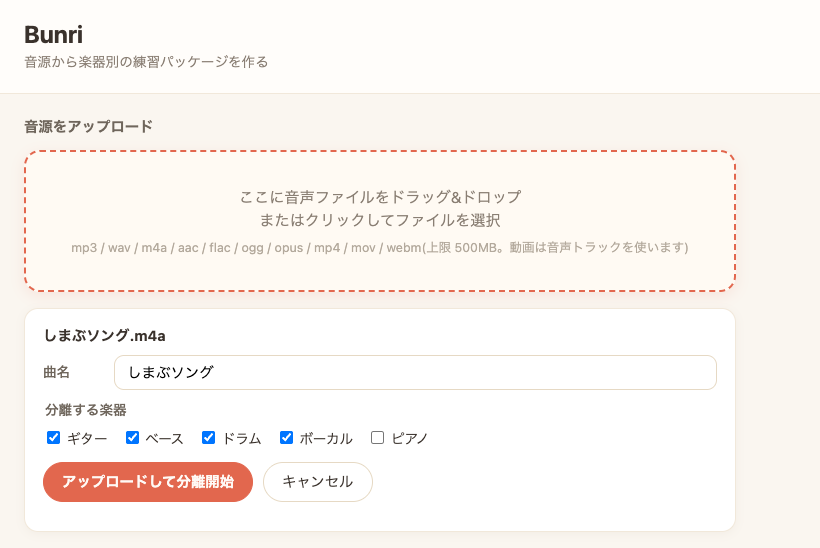
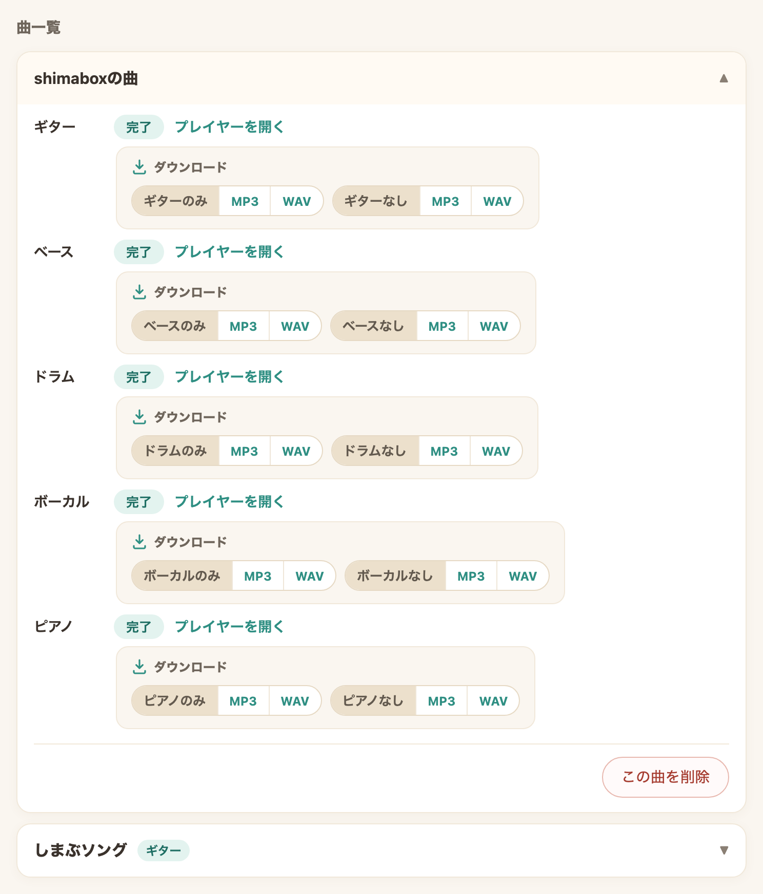
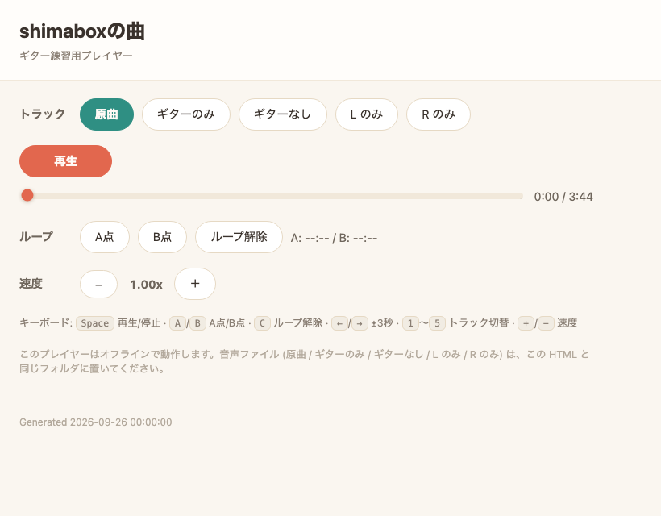

# Bunri

Bunri (分離, "separation") extracts a single instrument stem (guitar by default; bass, drums, vocals, piano also supported) from a song and builds a practice package: the instrument alone, the backing track without it, the original, and an offline HTML player with A-B loop and pitch-preserving slow-down. Audio processing runs locally on your machine; your audio is never uploaded. Documentation is in Japanese.

| アップロード | 曲一覧 | 練習プレイヤー |
|---|---|---|
|  |  |  |

音源から特定の楽器パート(まずはギター)の stem を抽出し、練習用パッケージ(その楽器だけ / その楽器を抜いた伴奏 / 原曲 + オフラインで再生できる HTML プレイヤー)を生成するツールです。処理はすべてお使いのマシン内で完結し、音源が外部に送信されることはありません。

## クイックスタート

対応 OS は Apple Silicon 搭載 Mac(macOS 14 以降)と Linux です。Intel Mac には対応していません。Windows の方は「[Windows で使う](#windows-で使う)」を見てください(WSL2 経由で使えます)。

先に次のものを入れておいてください(初回だけ):

- **Mac**
  - Xcode Command Line Tools: ターミナルで `xcode-select --install` (`git` と `make` が入ります)
  - Homebrew: <https://brew.sh> に書かれている1行のコマンドを実行(ffmpeg の導入に使います)
- **Linux(Ubuntu / Debian)**

  ```bash
  sudo apt update
  sudo apt install -y ffmpeg make git curl
  ```

Python は不要です(`make setup` が自動で用意します)。

```bash
# 1. リポジトリを取得して移動(ZIP の場合は、展開してできたフォルダへ移動して手順 2 へ)
git clone https://github.com/shimabox/Bunri.git
cd Bunri

# 2. セットアップ(uv / ffmpeg の確認と依存の導入。初回は数分)
make setup

# 3. 起動 — ブラウザで画面が開くので、曲をドラッグ&ドロップするだけ
#    (詳しくは「Web UI で使う」、コマンドラインは「使い方(CLI)」を参照)
make web
```

停止はターミナルで Ctrl+C。作った練習パッケージは `out/曲名/` に残り、中の `◯◯.player.html` はサーバーなしでもダブルクリックでそのまま使えます。

`make` が無い環境では `./setup.sh` → `uv run bunri-web` でも同じです。

### 注意事項(自己責任でご利用ください)

- 本ツールは現状のまま・無保証で提供されます。利用は自己責任でお願いします
- 入力は**正当に入手し、処理する権利のある音源だけ**にしてください。私的利用として許される範囲は国・地域と入手経路によって異なります
- 本ツールは分離した stem の公開・販売・共有を許諾するものではありません。出力物をどう扱うかの責任は利用者にあります
- 本ツールは音源の検索・取得・配信機能を持ちません。手元のファイルを手元で処理するだけです
- Bunri が使っているソフトや AI モデルの一部には、非商用の条件があります。そのため、**現在の Bunri は非商用利用を前提としています**。詳細は [THIRD_PARTY_NOTICES.md](THIRD_PARTY_NOTICES.md) と [MODEL_LICENSES.md](MODEL_LICENSES.md) を参照してください
- 初回の分離時に、分離モデル(約45MB〜、対象楽器による)がこのフォルダ内の `models/` へ自動ダウンロードされます(`BUNRI_MODEL_DIR` 環境変数で変更可能)。削除方法は「[アンインストール](#アンインストール)」を参照してください
- 分離には Apple Silicon の GPU(MPS)でも1曲あたり数分〜20分程度かかります

## セットアップ(手動でやる場合)

[uv](https://docs.astral.sh/uv/) と ffmpeg を導入済みなら:

```bash
uv sync --extra web   # CLI だけでよければ --extra web は不要
```

## Web UI で使う

ブラウザから音源をドラッグ&ドロップ/アップロードして分離を実行し、完了したらそのまま練習用プレイヤーを開ける、ローカル専用の簡易 Web UI です。コマンドラインに慣れていない方はまずこちらをどうぞ。

```bash
make web
```

これだけで起動します(初回は先に `make setup`)。`make` が無い環境では:

```bash
uv sync --extra web
uv run bunri-web
```

起動すると `http://127.0.0.1:8330/` がブラウザで自動的に開きます(**127.0.0.1 のみで待ち受け**。LAN 公開や認証には対応していません)。

- 音源をドロップ(またはクリックして選択)すると曲名確認欄が出るので、必要なら曲名を編集し、ギター / ベース / ドラム / ボーカル / ピアノから分離する楽器を複数選んでアップロードします。選択した楽器はサーバー側で1件ずつ順番に処理され、ブラウザを閉じてもジョブは継続します
- 曲一覧には1曲ごとに楽器別の「待機中 / 処理中(経過時間)/ 完了 / 失敗」が表示され、完了した楽器にはそれぞれの「プレイヤーを開く」リンクが表示されます(次回アクセス時もこの一覧・リンクは残ります)
- 完了した楽器の「ダウンロード」欄から、「楽器のみ」と「楽器なし」(その楽器を抜いた伴奏)を mp3 / wav で保存できます。ファイル名は「曲名_ギターのみ.mp3」のように分かりやすく、スマホに入れて聴いたり DAW に読み込んだりできます
- 同じ音源(内容が同一)と同じ楽器の組み合わせを再アップロードしても再分離はされず、既存の結果が再利用されます
- 曲を開いて「この曲を削除」を選ぶと、その曲の練習パッケージ、全ジョブ履歴とログ、ほかの曲と共有していないアップロード元とキャッシュをまとめて削除できます。待機中または処理中のジョブを含む曲は削除できません。削除は取り消せないため、確認画面の内容を確認してから実行してください

### 主なオプション

```bash
bunri-web --port 8330       # 待ち受けポート(既定: 8330)
bunri-web -o path/to/out    # 出力先ディレクトリ(既定: out。bunri CLI と共有可能)
bunri-web --no-open         # 起動時のブラウザ自動オープンを無効化
```

### できあがるファイル(ギターの場合)

曲 `song.m4a` を分離すると、`out/song/` に次のファイルができます。

| ファイル | 中身 | 用途 |
|---|---|---|
| `song.guitar.mp3` | ギターだけ | 「ここ何を弾いてる?」を聴き取る |
| `song.guitar.backing.mp3` | ギター抜き(それ以外全部) | 自分のギターを重ねて練習する |
| `song.original.mp3` | 原曲 | 聴き比べ |
| `song.guitar.player.html` | 練習プレイヤー | 上の3つを切り替えながら A-B ループ・スロー再生。ダブルクリックで開ける |
| `song.guitar.wav` / `song.guitar.backing.wav` | 上の mp3 と同じ音の無圧縮版 | DAW などで編集したいとき用。Web UI のダウンロード欄からも保存可能。練習だけなら不要(消しても OK) |

元の `song.m4a` はそのまま残ります(CLI は読むだけ。Web UI はアップロードした複製を `out/web/uploads/` に保存)。

なぜ wav があるのかというと、Bunri では音声の形式をそろえて安定して処理・再利用できるよう、入力を一度 wav に変換してから分離し、分離結果も wav で受け取るからです。mp3 はそこから「聴く用」に作っています。変換した入力の wav は `out/.cache/` に置かれ、同じ曲で別の楽器を追加するときに再利用されます。

## 使い方(CLI)

ターミナルから直接分離する場合はこちら。Web UI と出力形式は同じです。

```bash
make separate FILE=song.mp3   # または: uv run bunri song.mp3
```

実行すると `song.mp3` からギター stem を抽出し、`out/song/` に練習用パッケージ一式を生成します:

```
out/song/
├── song.guitar.wav / .mp3            # ギターのみ
├── song.guitar.backing.wav / .mp3    # ギターなし(それ以外全部)
├── song.original.mp3                 # 原曲
└── song.guitar.player.html           # オフライン練習プレイヤー
                                      #  (原曲/ギターのみ/ギターなし切替・
                                      #   ABループ・ピッチ維持スロー再生)
```

ファイル名に抽出対象(`guitar` など)が入っているのは、同じ曲を別の `--target` で追加ビルドしたとき(例: `--target vocals` でカラオケ音源を作る)に、同じフォルダへ共存できるようにするためです。`song.original.mp3` だけはどの対象でも同一内容なので共有されます。

中間生成物(正規化済み音声・分離済み stem)は `out/.cache/<入力ファイルのダイジェスト>/` にキャッシュされ、同じ入力・同じオプションでの再実行はスキップされます。

### 主なオプション

```bash
bunri song.mp3 --target vocals             # 抽出対象(既定: guitar)
bunri song.mp3 --model htdemucs_6s.yaml     # 分離モデルを明示指定(失敗時のフォールバックなし)
bunri song.mp3 --device cpu                 # auto(既定) | cpu | mps | cuda
bunri song.mp3 --no-mp3                     # wav のみ出力(mp3 変換をスキップ)
bunri song.mp3 --no-cache                   # キャッシュを無視して全段再計算
bunri song.mp3 -o path/to/out               # 出力先ディレクトリ
```

`--device` に `mps`/`cuda` を明示した場合、そのデバイスが実際に使えるか確認したうえで、使えなければ黙って CPU 等へフォールバックせずエラーになります(`auto` は従来どおり利用可能な最良のデバイスを自動選択します)。

### 抽出対象(--target)

| target | 既定モデル | 備考 |
|---|---|---|
| `guitar`(既定) | ギター特化 Mel-Band Roformer(becruily) | 実測比較で選定(ボーカル混入が htdemucs_6s の 1/3) |
| `bass` | htdemucs_6s(6-stem Demucs) | 専用モデルなし。6 stem 分離から該当パートを抽出 |
| `drums` | htdemucs_6s(6-stem Demucs) | 専用モデルなし。6 stem 分離から該当パートを抽出 |
| `vocals` | vocals_mel_band_roformer | カタログ実測 SDR 首位(12.60)。「ボーカルなし」はそのままカラオケ音源 |
| `piano` | htdemucs_6s(6-stem Demucs) | 専用モデルなし。6 stem 分離から該当パートを抽出 |

同じ曲でも `--target` ごとに分離キャッシュは独立しているため、対象を切り替えても過去の分離結果はそのまま再利用されます。

`--model` を省略した場合、対象楽器ごとに登録されたデフォルトモデルが失敗したときだけ自動でフォールバックモデルに切り替わります(ギターの場合 `htdemucs_6s.yaml`)。`--model` で明示的に指定した場合はフォールバックせず、失敗はそのままエラーとして報告されます。

## Docker で使う

ffmpeg・Python 3.13・分離モデルをまとめて動かしたいだけなら、`uv sync` のかわりに Docker イメージを使えます。ローカルに Python 環境を用意する必要はありません。

### ワンライナー

```bash
docker build --target cpu -t bunri:cpu .

docker run --rm \
  -v ./songs:/in \
  -v ./out:/out \
  -v bunri-models:/root/.cache/bunri/models \
  bunri:cpu /in/song.mp3 -o /out
```

- `bunri-models` という名前付きボリュームに分離モデルを永続化します。初回起動時に becruily モデル(約45MB)がここへダウンロードされ、以降の実行(同じボリュームを指定する限り)では再ダウンロードされません。
- `ENTRYPOINT` は `bunri` なので、`docker run` の末尾に渡す引数はそのまま CLI オプションとして扱われます(`--target` / `--model` / `--device` など、「主なオプション」節と同じものが使えます)。

### compose で使う

```bash
docker compose run --rm bunri /in/song.mp3 -o /out
```

`compose.yaml` は `./songs` を読み取り専用で `/in` に、`./out` を `/out` に、`bunri-models` ボリュームを `/root/.cache/bunri/models` にマウントします。`./songs` に音源ファイルを置いてから実行してください。

### 注意: Mac では GPU が使えない

macOS の Docker Desktop はコンテナに GPU を渡せないため、`cpu` イメージの分離処理は(ホストの Apple Silicon GPU=MPS を使うネイティブ実行に比べて)大幅に遅くなります(実測: 3分45秒の曲で MPS 実測295秒 → CPU コンテナでは15〜40分程度かかりうる)。日常的に何曲も分離するなら、Mac 上では `uv sync` によるネイティブ実行(`--device mps` または既定の `auto`)の方が高速な経路です。Docker はホスト環境を汚したくない場合や Linux/CI 上での実行に向いています。

### GPU (cuda) イメージについて

NVIDIA CUDA ランタイムベースの GPU 向けイメージを定義しています。`onnxruntime-gpu` が x86_64 の wheel しか公開していないため**linux/amd64 専用**です(Apple Silicon などの arm64 ホストでは `--platform linux/amd64` の指定が必須):

```bash
docker build --platform linux/amd64 --target cuda -t bunri:cuda .
```

このビルドが通ること(torch 2.13.0+cu130 / onnxruntime-gpu 1.27 が解決・インストールされること)は確認済みですが、**開発機(macOS / Apple Silicon)では GPU コンテナを実行できないため、GPU での分離処理そのものは未検証です**。Linux + NVIDIA GPU(CUDA 13 対応ドライバ)環境で使う場合は、まず動作確認してから使ってください。詳しい選定理由は NOTES.md を参照してください。

### dev イメージ(テスト実行用)

```bash
docker build --target dev -t bunri:dev .
docker run --rm bunri:dev            # pytest -q を実行
```

pytest・playwright(Chromium 込み)を含む開発用イメージです。CI などでコンテナ内にテストを閉じ込めたい場合に使えます。

## Windows で使う

ネイティブの Windows には現状対応していませんが、**WSL2(Windows 標準の Linux 実行環境)経由でそのまま使えます**。おすすめはこちらです。

### WSL2 で使う(推奨)

```powershell
# PowerShell(管理者)で初回のみ。終わったら再起動
wsl --install -d Ubuntu
```

再起動後、スタートメニューから Ubuntu を開いて、その中で:

```bash
sudo apt update
sudo apt install -y ffmpeg make git curl
git clone https://github.com/shimabox/Bunri.git
cd Bunri
make setup
make web
```

WSL2 の localhost は Windows 側に自動で転送されるので、**Windows のブラウザで http://127.0.0.1:8330/ がそのまま開きます**。曲もエクスプローラーからブラウザへドラッグ&ドロップするだけです(WSL の中のパスを意識する必要はありません)。

- 処理速度の注意: GPU なし(または NVIDIA 以外)の場合は CPU 処理になり、**1曲あたり 30〜40 分程度**かかります。NVIDIA GPU 搭載機では WSL2 の CUDA 対応で高速化できる余地がありますが、現状は未対応です(検討中)
- Docker Desktop をお使いなら「Docker で使う」節の手順もそのまま動きます(こちらも CPU 実行)

ネイティブ Windows 対応(setup.ps1・GPU 対応など)の検討状況は `.claude/plans/windows-support-plan.md` にまとめてあります。

## アンインストール

Bunri が作るもの(仮想環境 `.venv`・モデル `models/`・出力 `out/`・アップロードした音源 `out/web/uploads/`)は、標準設定ではすべてこのフォルダの中にあります。

1. **自分で置いた音源や作った練習パッケージが `songs/` `out/` にあれば、先に別の場所へ退避する**(フォルダごと消えます)
2. Docker で使っていた場合は、**フォルダを消す前に**コンテナ・モデル用ボリューム・イメージを削除します(`compose.yaml` がフォルダ内にあるため):

   ```bash
   docker compose down -v              # compose で使った場合(bunri_bunri-models ボリュームも削除)
   docker volume rm bunri-models       # ワンライナーで使った場合(別名のボリューム)
   docker rmi bunri:cpu                # ビルドしたイメージ
   ```

3. **`Bunri` フォルダを丸ごと削除する**
4. `BUNRI_MODEL_DIR` を変更していた場合は、その保存先も削除してください
5. `make setup` が新たに導入した uv / ffmpeg、および uv が導入した Python 本体やキャッシュはシステム側に残ります。これらはほかのプロジェクトと共有され得るので、不要と判断できる場合のみ各ツールの手順で削除してください:
   - ffmpeg: Homebrew で入れた場合は `brew uninstall ffmpeg`
   - uv: [公式のアンインストール手順](https://docs.astral.sh/uv/getting-started/installation/#uninstallation)を参照(公式インストーラ版はバイナリとキャッシュを手動で削除する方式)

## ライセンス

Bunri 自身のコードは [MIT License](LICENSE) です(Copyright (c) 2026 shimabox)。

ただし、実行に必要な依存ライブラリと学習済み AI モデルのファイルには別の条件があり、一部に非商用条件が含まれます(上の「注意事項」参照)。

- 依存ライブラリ・ツール: [THIRD_PARTY_NOTICES.md](THIRD_PARTY_NOTICES.md)
- 学習済み AI モデルのファイル: [MODEL_LICENSES.md](MODEL_LICENSES.md)

AI モデルのファイルはリポジトリに含めず、初回実行時に各配布元からダウンロードされます。
